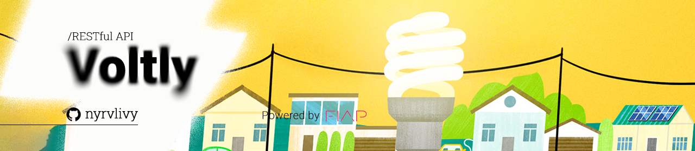

<div align="center">
  
</div>

<h1 align="center">Volty</h1>
<p align="center">IoT platform for energy management with real-time consumption monitoring and remote device shutdown via RESTful microservice.</p>

<div align="center">


</div>

##

## Índice

* [Descrição do Projeto](#descrição-do-projeto)
* [Como Executar](#como-executar)
  * [Com Spring Boot Local](#com-spring-boot-local)
  * [Com Docker](#com-docker)
* [Autenticação](#autenticação)
* [Endpoints Principais](#endpoints-principais)
  
---

## Descrição do Projeto

Voltly é uma API RESTful desenvolvida com Java 21 e Spring Boot para o gerenciamento de energia em ambientes com dispositivos IoT, alinhada aos princípios ESG. A plataforma oferece:

- Monitoramento de sensores de consumo em tempo real;
- Desligamento automático de equipamentos inativos;
- Relatórios diários de emissão de CO₂ e limites;
- Alertas automáticos para consumo excessivo;
- Recalculo mensal de metas energéticas.

A API permite que usuários autenticados administrem equipamentos, sensores e limites de consumo com segurança, escalabilidade e foco em sustentabilidade.

---

## Como Executar

### Com Spring Boot Local

1. Clone o repositório:

```bash
git clone https://github.com/seu-usuario/voltly-api.git
cd voltly-api
```

2. Configure o `application.yml` com as credenciais do seu banco Oracle:

```yaml
spring:
  datasource:
    url: jdbc:oracle:thin:@//localhost:1521/xe
    username: SEU_USUARIO
    password: SUA_SENHA
```

3. Compile e execute:

```bash
./mvnw spring-boot:run
```

A aplicação estará disponível em:  
**http://localhost:8080**

> ℹ️ Disponibilizamos um import do Insomnia com acesso a todos os endpoints disponíveis!

---

### 🐳 Com Docker

1. Compile o projeto Java:

```bash
./mvnw clean package -DskipTests
```

2. Construa os containers:

```bash
docker compose build
```

3. Suba a aplicação:

```bash
docker compose up
```

> ℹ️ Certifique-se de que seu banco Oracle esteja acessível ao container, e que a URL de conexão esteja ajustada no `application.yml` ou em variáveis de ambiente do `docker-compose.yml`.

## Autenticação

Voltly utiliza autenticação baseada em JWT.

- **Cadastro de usuário:**

```http
POST /auth/register
Content-Type: application/json

{
  "name": "Galileo Galilei",
  "email": "gali@voltly.com",
  "password": "P@ssw0rd123",
  "birthDate": "1990-05-15",
  "role": "USER"
}
```

- **Login:**

```http
POST /auth/login
Content-Type: application/json

{
  "email": "gali@voltly.com",
  "password": "P@ssw0rd123"
}
```

Resposta:
```json
{
  "token": "eyJhbGciOiJIUzI1NiIsInR..."
}
```

> Utilize o token JWT retornado no cabeçalho:  
`Authorization: Bearer <seu_token>`

---

## Endpoints Principais

> 🔒 A maior parte dos endpoints exigem autenticação com papel `USER` ou `ADMIN`.

Os principais endpoints estão agrupados na pasta `Endpoints Principais` no Insomnia. Eles são os mais importantes porque representam regras de negócio e cálculos:

### 📌 O que fazem:

- **Verifica ociosidade para desligamento**: avalia os últimos dados de sensores e aciona uma ação automática de desligamento se o consumo for baixo e não houver ocupação.
- **Geração de relatório diário de consumo**: calcula o consumo de energia por equipamento, registra e retorna o relatório.
- **Listagem de histórico de relatórios**: consulta relatórios anteriores por data e equipamento.
- **Relatórios de emissão de CO2**: converte consumo de energia em estimativas de emissão.
- **Recalculo mensal de limites**: ajusta os limites com base em média de consumo e margem de segurança.
- **Alertas de consumo**: gera alertas se o consumo ultrapassar o limite definido para o equipamento.

### 🧭 Tabela: Endpoints Principais

| Nome                           | Método | Rota                                          | Autenticação |
|--------------------------------|--------|-----------------------------------------------|--------------|
| Verifica ociosidade            | GET    | `/api/idle-actions`                           | ADMIN / USER |
| Gerar relatório diário         | POST   | `/api/reports/daily-consumption`              | ADMIN        |
| Histórico de relatórios       | GET    | `/api/reports/daily-consumption`              | ADMIN / USER |
| Relatórios de CO2             | GET    | `/api/reports/daily-consumption/co2`          | ADMIN / USER |
| Recalcular limites (mês atual)| POST   | `/api/limits/monthly-recalculation`           | ADMIN        |
| Recalcular com mês específico | POST   | `/api/limits/monthly-recalculation?yearMonth` | ADMIN        |
| Gerar alertas                 | POST   | `/api/alerts`                                 | ADMIN        |
| Buscar alertas                | GET    | `/api/alerts`                                 | ADMIN / USER |

---

## Coleções de Endpoints

A seguir, as tabelas organizadas por pasta do Insomnia. Todas incluem o método, rota e nível de autenticação.

### 🔐 Auth

| Nome     | Método | Rota            | Autenticação |
|----------|--------|------------------|--------------|
| Login    | POST   | `/auth/login`    | ALL          |
| Register | POST   | `/auth/register` | ALL          |

---

### 👤 Users

| Nome                       | Método | Rota                       | Autenticação |
|----------------------------|--------|----------------------------|--------------|
| Criar usuário              | POST   | `/api/users`               | ADMIN        |
| Buscar todos              | GET    | `/api/users`               | ADMIN        |
| Buscar por ID             | GET    | `/api/users/{id}`          | ADMIN        |
| Buscar por e-mail         | GET    | `/api/users?email`         | ADMIN        |
| Atualizar por ID          | PUT    | `/api/users/{id}`          | ADMIN / USER |
| Ativar / Desativar        | PATCH  | `/api/users/{id}/(de)activate` | ADMIN    |
| Deletar                   | DELETE | `/api/users/{id}`          | ADMIN        |
| Buscar por data nascimento| GET    | `/api/users?birthDateAfter&birthDateBefore` | ADMIN |
| Buscar por nome           | GET    | `/api/users/search?name`   | ADMIN        |
| Meus dados                | GET    | `/api/users/me`            | USER         |
| Atualizar meus dados      | PUT    | `/api/users/me`            | USER         |

---

### 🖥️ Equipments

| Nome             | Método | Rota                         | Autenticação |
|------------------|--------|------------------------------|--------------|
| Criar equipamento| POST   | `/api/equipments`            | ADMIN / USER |
| Buscar todos     | GET    | `/api/equipments`            | ADMIN        |
| Buscar por ID    | GET    | `/api/equipments/{id}`       | ADMIN / USER |
| Atualizar        | PUT    | `/api/equipments/{id}`       | ADMIN / USER |
| Ativar / Desativar| PATCH | `/api/equipments/{id}/...`   | ADMIN / USER |
| Deletar          | DELETE | `/api/equipments/{id}`       | ADMIN / USER |
| Meus equipamentos| GET    | `/api/equipments/me`         | USER         |

---

### 🧠 Sensors

| Nome                   | Método | Rota                            | Autenticação |
|------------------------|--------|---------------------------------|--------------|
| Criar sensor           | POST   | `/api/sensors`                  | ADMIN / USER |
| Atualizar              | PATCH  | `/api/sensors/{id}`             | ADMIN / USER |
| Buscar todos           | GET    | `/api/sensors`                  | ADMIN        |
| Buscar por ID          | GET    | `/api/sensors/{id}`             | ADMIN / USER |
| Buscar por número      | GET    | `/api/sensors?serial=...`       | ADMIN / USER |
| Deletar                | DELETE | `/api/sensors/{id}`             | ADMIN / USER |
| Meus sensores          | GET    | `/api/sensors/me`               | USER         |

---

### ⚡ Energy Readings

| Nome                  | Método | Rota                              | Autenticação |
|-----------------------|--------|-----------------------------------|--------------|
| Criar leitura         | POST   | `/api/readings`                   | ADMIN        |
| Listar leituras       | GET    | `/api/readings`                   | ADMIN        |
| Buscar por ID         | GET    | `/api/readings/{id}`              | ADMIN / USER |
| Últimas 3 leituras    | GET    | `/api/readings/sensor/{id}/last` | ADMIN / USER |
| Faixa de tempo        | GET    | `/api/readings/sensor/{id}`      | ADMIN / USER |
| Deletar leitura       | DELETE | `/api/readings/{id}`             | ADMIN        |
| Minhas leituras       | GET    | `/api/readings/me`               | USER         |

### 🚦 Consumption Limits

| Nome                         | Método | Rota                               | Autenticação |
|------------------------------|--------|------------------------------------|--------------|
| Criar limite                 | POST   | `/api/limits`                      | ADMIN        |
| Atualizar                   | PUT    | `/api/limits/{id}`                 | ADMIN        |
| Buscar todos                | GET    | `/api/limits`                      | ADMIN        |
| Buscar por ID               | GET    | `/api/limits/{id}`                 | ADMIN        |
| Buscar por equipamento      | GET    | `/api/limits?equipmentId=...`     | ADMIN / USER |
| Recalcular mensal           | POST   | `/api/limits/monthly-recalculation` | ADMIN      |
| Deletar                     | DELETE | `/api/limits/{id}`                 | ADMIN        |
| Meus limites                | GET    | `/api/limits/me`                   | USER         |

---

### ⚙️ Automatic Actions

| Nome                          | Método | Rota                        | Autenticação |
|-------------------------------|--------|-----------------------------|--------------|
| Criar ação automática         | POST   | `/api/actions`              | ADMIN        |
| Buscar todas                  | GET    | `/api/actions`              | ADMIN        |
| Buscar por ID                 | GET    | `/api/actions/{id}`         | ADMIN / USER |
| Buscar por equipamento        | GET    | `/api/actions?equipmentId=...` | ADMIN / USER |
| Deletar ação automática       | DELETE | `/api/actions/{id}`         | ADMIN        |
| Minhas ações automáticas      | GET    | `/api/actions/me`           | USER         |

---

##### tags: `Voltly` `Java` `Spring Boot` `ESG` `RESTful API` `Energia` `Monitoramento` `ESG`

<div align="center">
  
</div>
